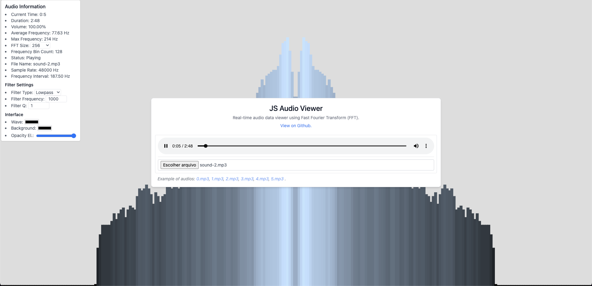

## 🔊 JS Audio Viewer 🎛️

Web application for real-time audio analysis and visualization using the browser's Audio API. Utilizing the Fast Fourier Transform (FFT), the application allows you to visualize the audio frequency spectrum and apply filters for data manipulation.



### ⚙️ How It Works

The Web Audio Analyzer uses FFT to capture audio frequency data and render it on the HTML `<canvas>` element. The main functionalities include:

- **FFT (Fast Fourier Transform)**: Quickly decomposes the audio signal into frequency components.

    $X[k] = \frac{1}{N} \sum_{n=0}^{N-1} x[n] \cdot e^{-j \frac{2 \pi}{N} k n}$

    Where:
    - $X[k]$ is the $k$-th coefficient of the FFT.
    - $x[n]$ are the input sample values in the time domain.
    - $N$ is the total number of samples (FFT size).
    - $e^{-j \frac{2 \pi}{N} k n}$ is the complex exponential base used in the transformation.

    To apply this more simply, we use the Web API [AudioContext](https://developer.mozilla.org/en-US/docs/Web/API/AudioContext).

    ```js
    // ...
    this.audioContext = new AudioContext();
    this.audioAnalyser = this.audioContext.createAnalyser();
    this.audioAnalyser.fftSize = fftSize; // power of 2 like 256, 512, 1024, etc.
    // ...
    ```

- **Filters**:
  - **Lowpass**: Attenuates frequencies above a specific cutoff frequency.
    
    $H_{\text{lowpass}}(f) = \frac{1}{1 + j\frac{f}{f_c}}$

    Where $f_c$ is the cutoff frequency.
  - **Highpass**: Attenuates frequencies below a specific cutoff frequency.

    $H_{\text{highpass}}(f) = \frac{j\frac{f}{f_c}}{1 + j\frac{f}{f_c}}$

    Where $f_c$ is the cutoff frequency.
  - **Bandpass**: Allows only frequencies within a specific range to pass.
    
    $H_{\text{bandpass}}(f) = \frac{j\frac{Q f}{f_0}}{1 + j\frac{Q f}{f_0} - \left(\frac{f}{f_0}\right)^2}$

    Where $f_0$ is the center frequency and $Q$ is the bandwidth.
  - **Notch**: Attenuates a narrow band of frequencies around a central frequency.
    
    $H_{\text{notch}}(f) = \frac{1 + \left(\frac{f_0}{Q}\right)^2}{1 + j\left(\frac{f}{Q f_0}\right) + \left(\frac{f}{f_0}\right)^2}$

    Where $f_0$ is the center frequency and $Q$ is the quality factor.

- **Information Listing**:
  - Current Time
  - Duration
  - Volume
  - Average Frequency
  - Max Frequency
  - FFT Size
  - Frequency Bin Count
  - Status
  - File Name
  - Sample Rate
  - Frequency Interval

- **Visual Representation:** The interface allows for better visualization of the generated pulses by changing their color or the background. You can also make the application settings boxes transparent to clearly see the background.

### 🎵 Test Audios

0. [audio0.mp3](https://github.com/ErnaneJ/ja-audio-viewer/blob/main/assets/sounds/sound-0.mp3)
1. [audio1.mp3](https://github.com/ErnaneJ/ja-audio-viewer/blob/main/assets/sounds/sound-0.mp3)
2. [audio2.mp3](https://github.com/ErnaneJ/ja-audio-viewer/blob/main/assets/sounds/sound-0.mp3)
3. [audio3.mp3](https://github.com/ErnaneJ/ja-audio-viewer/blob/main/assets/sounds/sound-0.mp3)
4. [audio4.mp3](https://github.com/ErnaneJ/ja-audio-viewer/blob/main/assets/sounds/sound-0.mp3)
5. [audio5.mp3](https://github.com/ErnaneJ/ja-audio-viewer/blob/main/assets/sounds/sound-0.mp3)